# Journey-Mate Database Schema Reference

This document provides a visualization of the data architecture supporting the Journey-Mate platform.

## Entity Relationship Diagram

```mermaid
%%{init: { 'theme': 'base', 'er': { 'useMaxWidth': false, 'fontSize': 24 } } }%%
erDiagram
    journeys ||--o{ journey_itinerary : "organizes"
    journeys ||--o{ journey_souvenirs : "preserves"
    journeys ||--o{ journey_requests : "manages"
    journeys ||--o{ journey_messages : "contains"
    journeys ||--o{ journey_expenses : "tracks"
    journeys ||--o{ user_reviews : "collects"
    journeys ||--o{ journey_emergency_contacts : "secures"

    journeys {
        uuid id PK
        text user_id "Clerk Owner ID"
        text origin
        text destination
        date date
        text flight_number
        text description
        text airline_name
        text airline_iata
        text contact_info
        text boarding_pass_url
        numeric user_rating
        boolean user_verified
        timestamp created_at
    }

    journey_itinerary {
        uuid id PK
        uuid journey_id FK
        text title
        text description
        text type "meetup | activity | layover | food | transport"
        timestamp start_time
        text location
        text created_by
    }

    journey_souvenirs {
        uuid id PK
        uuid journey_id FK
        text user_id
        text type "photo | note"
        text content "URL or Text"
        text caption
        timestamp created_at
    }

    jobs {
        uuid id PK
        text title
        text dept
        text type
        text location
        boolean active
        timestamp created_at
    }

    journey_requests {
        uuid id PK
        uuid journey_id FK
        text requester_id "Clerk User ID"
        text requester_name
        text requester_avatar
        text status "pending | accepted | rejected"
        numeric compatibility_score
        text compatibility_reason
        timestamp created_at
    }

    journey_messages {
        uuid id PK
        uuid journey_id FK
        text sender_id "Clerk User ID"
        text sender_name
        text content
        boolean is_system "System notification flag"
        timestamp created_at
    }

    journey_expenses {
        uuid id PK
        uuid journey_id FK
        text payer_id "Clerk User ID"
        decimal amount
        text description
        boolean is_settlement "True for peer-to-peer payments"
        text receiver_id "Clerk Recipient ID"
        timestamp created_at
    }

    user_reviews {
        uuid id PK
        uuid journey_id FK
        text reviewer_id "Clerk User ID"
        text reviewee_id "Clerk User ID"
        text content "Kudos feedback"
        text type "positive | neutral | negative"
        text[] badges
        timestamp created_at
    }

    user_profiles {
        uuid id PK "Matches Clerk ID"
        text username
        text avatar_url
        numeric avg_rating
        integer review_count
        text[] languages
        text specialty
        boolean is_verified
    }

    journey_emergency_contacts {
        uuid id PK
        uuid journey_id FK
        text user_id "Clerk User ID"
        text contact_name
        text contact_phone
        text relation
        timestamp created_at
    }
```

## Relationship Logic

1.  **Centralized Architecture**: The `journeys` table acts as the primary anchor for all collaborative features. All utility data is tied to a specific journey via `journey_id`.
2.  **External Identity**: High-level identity (User Profiles) is managed by **Clerk**. The local database stores Clerk IDs (`user_id`, `payer_id`, etc.) to facilitate data attribution without duplicating the entire auth profile.
3.  **Collaborative Timeline**: The `journey_itinerary` and `journey_souvenirs` tables enable real-time collaboration and memory preservation for accepted companions.
4.  **Reputation System**: The `user_reviews` table now includes `badges` to visualize specific trust traits awarded by the community.
5.  **Lifecycle Management**: 
    - **Requests** manage participant entry.
    - **Itinerary** and **Messages** provide real-time coordination.
    - **Souvenirs** and **Expenses** handle memory sharing and settlements.
    - **Reviews** build long-term platform trust.
