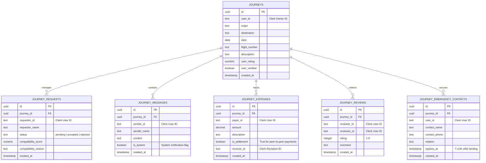

# Journey-Mate Database Schema Reference

This document provides a visualization of the data architecture supporting the Journey-Mate platform.

## Entity Relationship Diagram

## Relationship Logic

1.  **Centralized Architecture**: The `journeys` table acts as the primary anchor for all collaborative features. All utility data is tied to a specific journey via `journey_id`.
2.  **External Identity**: High-level identity (User Profiles) is managed by **Clerk**. The local database stores Clerk IDs (`user_id`, `payer_id`, etc.) to facilitate data attribution without duplicating the entire auth profile.
3.  **Lifecycle Management**: 
    - **Requests** manage participant entry.
    - **Messages** and **Expenses** provide real-time collaboration.
    - **Vault** provides time-gated security (automatic expiration).
    - **Reviews** ensure long-term trust and safety.
